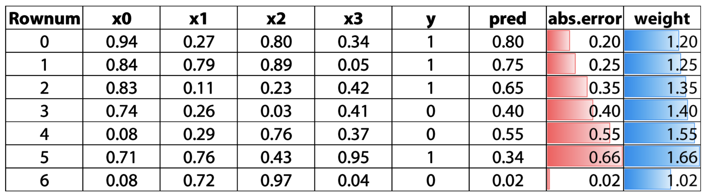
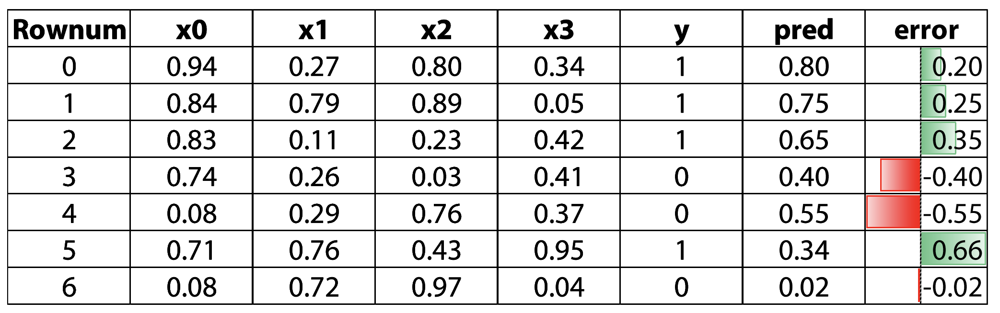
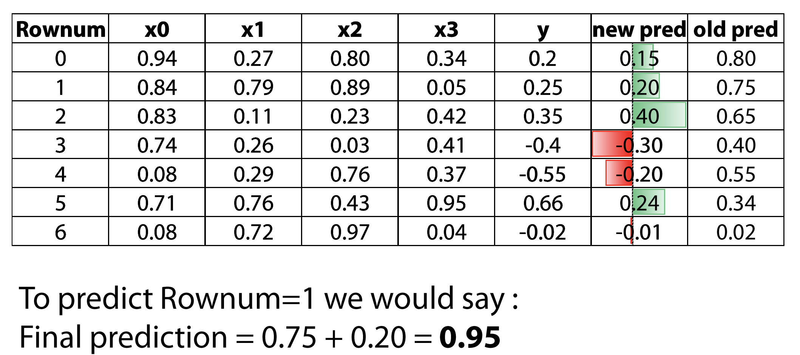
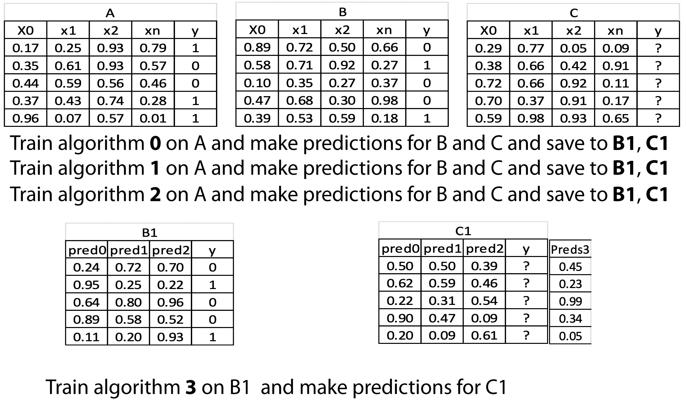
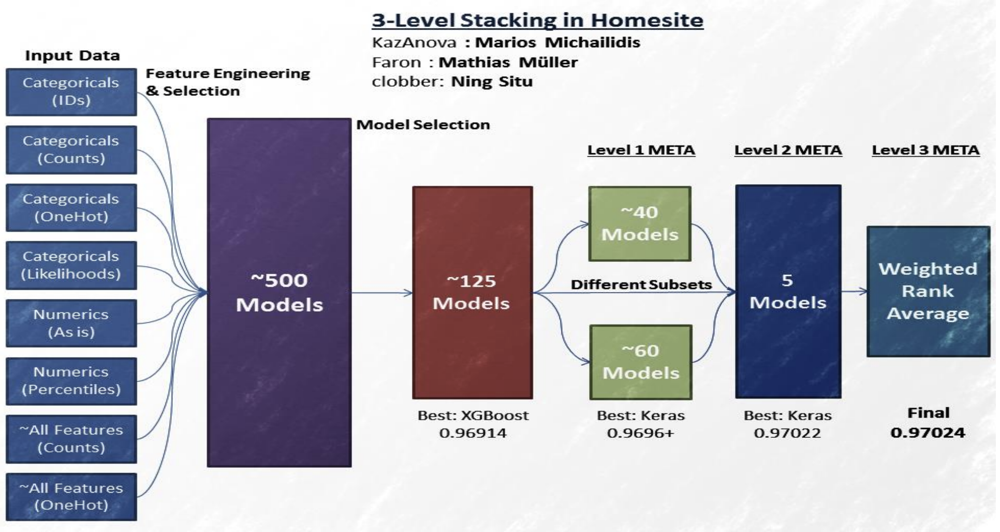
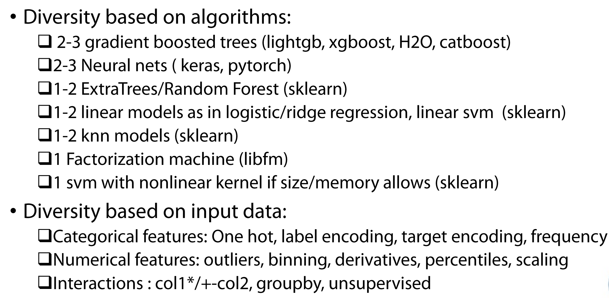
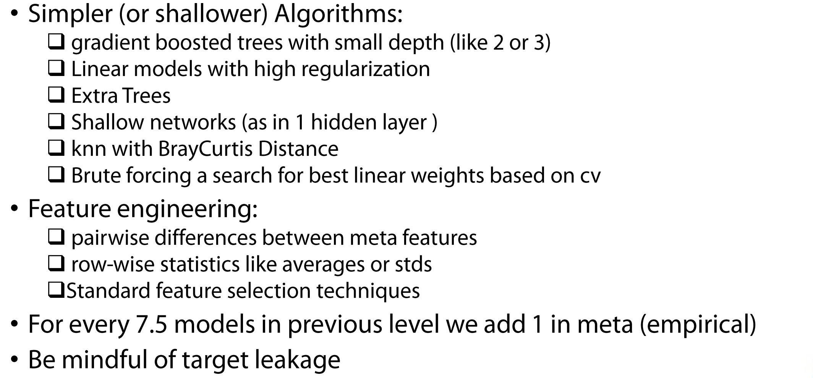
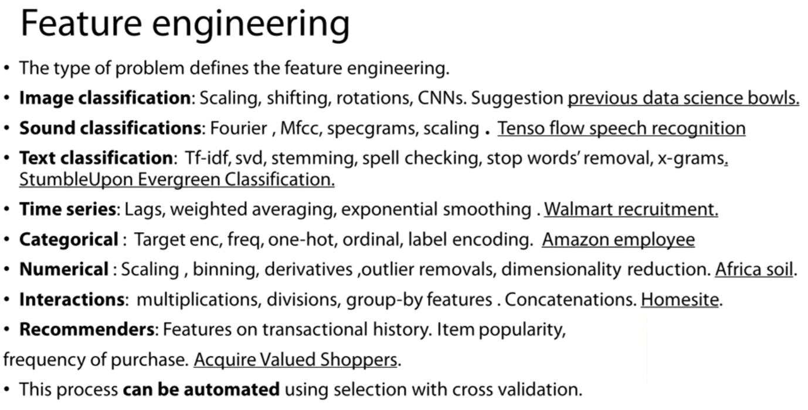
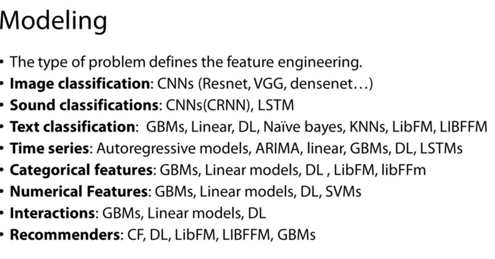
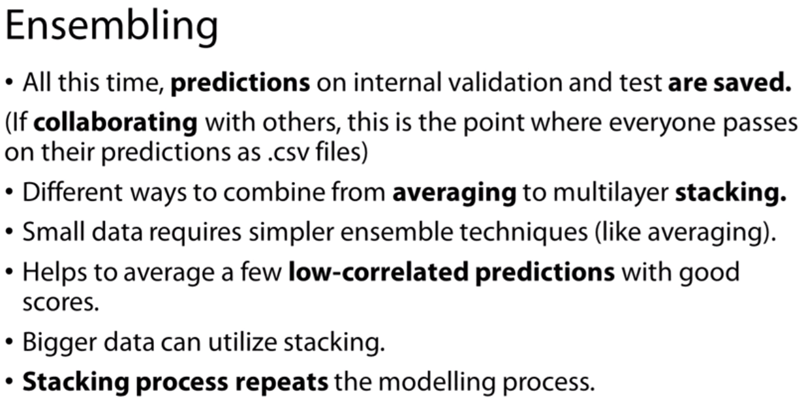

_**Notes from the course "How to Win a Data Science Competition: Learn from Top Kagglers" from Coursera: https://www.coursera.org/learn/competitive-data-science**_

# I. Recap of main ML algorithms

**Linear models**
 Linear models, split space into 2 subspaces with a hyperplane (Ex.: Linear Reg., Logistic Reg., Linear SVM). Good for sparse, high dimensional data, where there are linear dependencies.
 <a href=https://sebastianraschka.com/faq/docs/logistic_regression_linear.html> Why is logistic regression considered linear? </a>
 *Logistic regression assumption: Data samples are independently and identically distributed (so-called i.i.d assumption)*

**Tree-based methods**
Decision tree is the main construction block. Uses divide and conquer approach to recursively divide the space into subspaces (or boxes). In regression tasks aproximates points in the boxes with a constant. A bad choise when data has linear dependencies.

**kNN-based methods**
Points close to each other are likely to have the same labels. Heavily rely on how to measure points "closeness"

**Neural Networks** 
Produce smooth separating curve (in contrast to decision trees).

***No free lunch theorem***: *There is no method which outperforms all others for all tasks. There is no "silver bullet algorithm"*

# II. Feature processing

Remember: Preprocessing and generation pipelines depend on a model type.

For instance:
- Lineal models require hot-encoded variables if the dependencies between numerical features and target are not linear
- Decision-tree-based models do not need one hot encoding. These models also don't depend on feature scaling


## A. Numeric features

### Preprocessing

#### Feature scaling:
Scale all features to one a specific range/distribution, so that their  impact on the model will be roughly similar.

Tree-based models don't depend on feature scaling while Linear Models , kNN and neural networks do: regularization impact is proportional to feature scale and  gradient descent methods will go crazy without the proper scaling.

Types: 
- Min-max scaling (distributions do not change)
- Standard scaler (Goal: `mean=0` and `std=1`)


#### Outliers treatment
Outliers affect linear models. To prevent them we can use winzorisation: clip feature values ammong a low and a high percentile.

#### Rank transformation
Used to set spaces between sorted feature values to be equal. Can be also used to treat outliers as with the rank they will be closer to other values. Linear models, KNN and Neural Networks can also benefit from this transformation. Can be applied to train+test data.

#### Other transformations
The following transformations drive big values to the features average value. Besides, values closer to zero become more distinguishable :
- Log transform: `np.log(1+x)`
- Raising to the power <1: `np.sqrt(x+2/3)`

*Hint: use ensemble methods with different preprocessings to achieve better results*


## B. Categorical and ordinal features

#### Label encoding
Map each category to an unique value. Useful for tree-based models. Not always useful for linear models or NN unless the values assigned are correlated with the target. 

Types:
- Alphabetical order
- Order or appearance
- Meaningful order (in case the categorical variable is ordinal)
- Frequency encoding: Map each category to its frequency in the data set. For multiple categories with the same frequency we can use a rank operation 

#### One-hot encoding
Creates a new column for every category. Works better with non-tree-based models than with tree-based ones due to the explosion in the number of features


## C. Datetime and coordinates

#### Datetime 

1. Periodicity: Day number in week, month, season, year, second, minute, hour.
2. Time since
	a. Row-independent moment: For example, since 00:00:00 UTC, 1 January 1970;
	b. Row-dependent important moment: Number of days left until next holidays/ time passed after last holiday.
3. Difference between dates: `datetime_feature_1 - datetime_feature_2`

#### Coordinates

Ideas:
- Calculate distance to the nearest shop, hospital, school, etc
- Organize data into clusters and add distance to the center of clusters
- Compute aggregated stats per area: Price per `m^2`, number of flats
with tree based models, you can add rotations of the coordinates as new features

## D. Handling missing values

Different methods to fill the missing values: 
- Replace them by other value (999, -1) (decision-based models)
- Mean, median  (linear models, NN,  KNN)
- Reconstruct values (time series)
- Add Isnull feature

Note 1 : Avoid filling missing values before feature generation 
Note 2: Finding hidden missing values encoded as a numerical value: Plot histogram and look for abnormal peaks!
Note 3: XgBoost can handle NaN

# III. Exploratory data analysis

General advice: 
- Get domain knowledge
- Check if the data is intuitive and consistent with its definition
- It is crucial to understand how the data was generated to set up a proper validation schema. For instance if the distribution of the test set is different from the training set, we cannot validate our model with a sample of the training set
- Visualization is important: Patterns lead to questions (or hypothesis) and hypothesis can be supported by graphics

Useful Pandas methods: `df.types`, `df.info()`, `df.describe()`, `x._value_counts()`, `x.isnull()`

Useful visualization tools:
- Histograms (be careful with bins!):  `plt.hist(x)`
- Plot index vs value (can show leakages): `plt.plot(x,'.')` 
- Plot index vs value colored by target value: `plt.scatter(range(len(x)),x ,c=y)`
- Exploring features relations: `plt.scatter(x1,x2)`, `pd.scatter_matrix(df)`
- Correlation matrices: `plt.matshow()` . Biclustering algorithms for sorting corrplots: https://scikit-learn.org/stable/auto_examples/bicluster/plot_spectral_biclustering.html
- Plot mean values of individual features: `df.mean().sort_values().plot(style='.')`

**Dataset cleaning and other aspects to check**

- Remove features with zero variance in training set
- Check for duplicated rows (check if same rows have same label)
- Check for duplicated columns:
```
for col in categorical_cols:
	train_test[col] = train_test[col].factorize()[0]

train_test.T.drop_duplicates
```

# IV. Feature Engineering 


### Interactions
Concatenated categories, multiplication or division of numerical features. 
Examples: click rates, price per `m^2`,  calculated distances with Pytagoras theorem. These features are beneficial for methods such as GBT as they experience dificultiexs with approximations of multiplications and divisions

* We have a lot of possible interactions − `N*N` for `N` features. Even more if use several types in interactions
* Need to reduce its’ number by
   a. Dimensionality reduction
   b. Feature selection (for example, use random forest and calculate feature importance)
* Interactions can also be extracted from decision-trees by mapping each leaf into a binary feature and using the index of the object's leaf as a value for a new categorical feature. *Somehow confusing in the video, this method needs more explanation*. 
    In sklearn use `tree_model.apply()` and in xgboost use `booster.predict(pred_leaf=True)`

### Fractional part 
Fom 5.99, 0.99 is the factional part. Useful for price variables, for instance

### Statistics of groups
For example, for a CTR task (which involves adds in different pages seen by different users) one can calculate:
* The lowest and highest prices of adds grouping by user and page
* How many pages user has visited 
* How many pages has the user visited per session
* Standard deviation of prices
* The most visited page

What if there is no features to use groupby on? We can use grouping operations on neighbors. For instance, in the problem of predicting rental prices one can calculate:
* Number of houses in 500m, 1000m,..
* Average price per square meter in 500m, 1000m,..
* Number of schools/supermarkets/parking lots in 500m, 1000m,..
* Distance to closest subway station or gym, etc.

### Matrix factorization
General approach for dimensionality reduction and feature extracting. For example, can be of great use on non-curated categories. It is  is similar in spirit to linear models, so can use the same transformation tricks, such as `log(x+1)`

* Can provide additional diversity: Good for ensembles
* It is a lossy transformation. Its’ efficiency depends on:
    * Particular task
    * Number of latent factors (Usually 5-100)

Methods:
* SVD and PCA: Standard tools for Matrix Factorization
* TruncatedSVD: Works with sparse matrices
* Non-negative Matrix Factorization (NMF): Ensures that all latent factors are non-negative. Good for counts-like data. Males 

**Wrong way**:
```
pca = PCA(n_components=5)
X_train_pca = pca.fit_transform(X_train)
X_test_pca = pca.fit_transform(X_test)
```

**Right Way**:
```
X_all = np.concatenate([X_train,X_test])
pca.fit(X_all)
X_train_pca = pca.transform(X_train)
X_test_pca = pca.transform(X_test)
```

### tSNE
Also called **manifold learning**. It is one of the non-linear methods of dimensionality reduction, which projects points from a high dimensional space in to a smaller dimensional space so that the distance among points is aproximately preserved. Sometimes that projection shows explicit clusters.

Facts from tSNE: 
- Great tool for visualization
- If the data has a explicit structure, it's likely to be reflected on the tSNE plot.
- Hyperparameters tuning is extremely important: tSNE results extremely depends on its parameters. Use several projections with different perplexities (5-100).
- Can be considered as a method to obtain new features from data
- Train and test set should be projected together rather than separately
- Due to long running time, a reduction dimensionality approach can be done prior to the projection
- Implementation can be found in sklearn, but the stand-alone implementation python package its faster

Useful blog post: https://distill.pub/2016/misread-tsne/

# V. Advanced feature Engineering: Mean encodings
Use them for categorical variables with high cardinality.

* Simplest case:  Encode each level of the categorical variable with the corresponding target mean:
```
means = x_train.groubpy(col).target.mean()
train_new[col+'_mean_target'] = train_new[col].map(means)
val_new[col+'_mean_target'] = val_new[col].map(means)
```
* Alternatives: 
    - `ln(Goods/Bads)*100` (weight of evidence)
    - Count number of ones: `sum(target)`
    -  `Goods - Bads`

Why does it work? It gives some logical order when there are too many categories.
When is it useful?  For algorithms like GBDT: one of the few downsides is its inability to handle high cardinality categorical variables, because trees have limited depth; with mean encodings, we can compensate for this limitation. One sign that may indicate the need for this encoding is to get better performance (without overfitting) for larger tree depths. This indicates trees need a huge number of splits to extract information from some variables


**Validation/Regularization**

It's got to be impeccable in order to avoid having leakages from the target variable. It needs regulatization. 

1) CV loop inside training data: For a given data point, we don't want to use target variable of that data point. So we separate the data into K subsets (folds). To get the mean encoding for a particular subset, we don't use data points from that subset and estimate the encoding only on the rest of subsets. Usually decent results with 4-5 folds. Fill nans with global mean (check implementation on slides).

2) Smoothing
Based on this idea: If a category has a lot of values, then we can trust the mean encoding, but if category is rare it's the opposite. 
` (mean(target)*nrows + globalmean*alpha) / (nrows+alpha) `
It has hyper parameter alpha that controls the amount of regularization. When alpha is zero, we have no regularization, and when alpha approaches infinity everything turns into globalmean. In some sense alpha is equal to the category size we can trust.
We can combine it with, for example, CV loop regularization. 

3) Adding random noise: Meaning encoding will have a better quality for the training data than for the test data. And by adding noise, we simply degrade the quality of encoding on training data. Pretty unstable and hard to make it work, so it will take some time.

4) Sorting and calculating expanding mean
We fix some sorting order of our data and use only rows from zero to `n-1` to calculate encoding for row n (check implementation on slides). This method introduces the least amount of leakage from target variable and it requires no hyper parameter tuning. The only downside is that feature quality is not uniform. To overcome this, we can average models on encodings calculated from different data permutations. Built-in in CatBoost (good for categorical features).


**How to do mean encodings for other tasks?**

* Regression: Use percentiles, standard dev., distribution bins
* Multiclass classification: For every feature we want to encode we will have n encodings, where n is the number of classes to predict
* Many-to-many relations: Create a "mean encoding vector" for every entity and then generate statistics on that vector
* Timeseries: Rolling statistics of target variable
* Interactions and numerical features: Analize fitted model. Selecting interactions and binning numeric results.


**Summary**
Main advantages:
* Compact transformation of categorical variables
* Powerful basis for feature engineering
Disadvantages:
* Need careful validation, there a lot of ways to overfit
* Significant improvements only on specific datasets

# VI. Validation strategies

There are three main validation strategies:
1. **Holdout** (i.e. 70% for training, 30% for testing). Use if validation results and/or optimal parameters among different splits do not change "too much"
2. **k-Fold**. Use if scores and optimal parameters differ for different splits.
3. **Leave One Out** (iterate though every point in your data). Use if you have too little data.

*Hint: Stratification preserves the same target distribution over different folds*

Data slitting strategies:
- Random-based splitting
- Time-based splitting. Special case: Window moving validation.  
- ID-based splitting

*Note: Ensure similar distributions between your validation set and the test set (In most cases, the reality!)*

### Specific advice for Kaggle competitions: 

 If we have big dispersion of scores on validation stage, we should do extensive validation:
- Average scores from different KFold splits
- Tune model on one split, evaluate score on the other

If submission’s score do not match local validation score,we should
- Check if we have too little data in public LB
- Check if we overfitted
- Check if we chose correct splitting strategy
- Check if train/test have different distributions

Expect LB shuffle because of
- Randomness
- Little amount of data
- Different public/private distributions


# VII. Model performance metrics

### Regression metrics
- **MSE**: Mean Squared Error. Best constant: target mean 
- **RMSE**: Root Mean Squared Error. Best constant: target mean. More intuitive than MSE. It is not completely interchangeable for gradient-based methods as their gradients are not equal (there is a scaling factor)
- **R-squared**: How much our model is better than the constant baseline. Best constant: target mean. MSE, RMSE, R-squared are the same from an optimization perspective
- **MAE**: Mean absolute error. Best constant: target median. Use it when you have big outliers in the data that you don't want to penalize much. Problem: The gradient is not defined when the prediction is perfect.
- **(R)MSPE**: Mean Squared Percentage Error. Weighted version of MSE so that it cares about relative errors. Best constant: weighted target meann (objects with a small target value have higher weights)
- **MAPE**: Mean Absolute Percentage Error. Weighted version of MAE so that it cares about relative errors. Best constant: weighted target median (objects with a small target value have higher weights)
- **(R)MSLE**: Root Mean Square Logarithmic Error. Used in the same situation than MSPE and MAPE as it cares about relative errors. However it penalizes more lower predictions than higher ones.


### Classification metrics :
- **Accuracy**: How frequently our class prediction is correct. Best constant: predict the most frequent class
- **LogLoss**: Logloss strongly penalizes completely wrong answers (remember that it looks at posterior probabilities). For example if we have a classifier assigning 0.4 score to an object of class 1, and other assigning 0.1, the later will be more penalized on this particular object. Best constant: set `a_i` to frequency of `i-th` class. TODO: when to use it?
- **AUC-ROC**: Depends only on ordering of the predictions, not on absolute values. Can be seen as a pairwise loss: probability of pair objects to be ordered in the right way. Best constant: All constants give same score. Random predictions lead to AUC = 0.5
- **Cohen’s (Quadratic weighted) Kappa**: Uses a baseline accuracy (i.e. percentage of largest class) to normalize accuracy. Very similar to what R2 does with MSE. There are versions of the metric using weights.

# VIII. Metrics optimization

### General approaches for metrics optimization
Note that the *performance metric* is what we want to optimize; however,  what the model optimizes instead is its defined *error loss*. In some cases both coincide and you just need to run the right model. Other options include: 
* Optimize another metric, by preprocessing training set and/or postprocessing predictions
* Write your custom loss function
* Optimize another metric, use early stopping: Optimize metric M1, monitor metric M2. Stop when M2 score is the best

### Regression metrics optimization

**MSE**: 
Can be found in many different libraries. Other names: L2 loss.

**MAE**: 
Available only in some libraries. Similar to huber loss (Mix between MSE and MAE). Other names for MAE: L1, quantile loss.

**MSPE and MAPE**:
Not commonly implemented. Options:
- Use the fact that they are weighted versions of MSE and MAE and tune the parameter 'sample_weights' in your models when available. Use MSE/MAE to optimize. 
- Re-sample the training set with the corresponding weights `df.sample(weights=sample_weights)` (See slides corresponding to this topic). Test set stays as it is. Use MSE/MAE to optimize. Usually one needs to resample many times and average the result.

**RMSLE**:
1) In the training set transform the target: `z_i=log(y_i+1)`. 
2) Fit a model with MSE loss
3) Transform the predictions back: `y_{pred}=exp(z_{pred_i}-1)`

### Classification metrics optimization

**LogLoss**:
Can be found in many different libraries. Note that it requires model to output posterior probabilities (i.e. if we take all objects with score 0.8, 80% of them will have class 1 and 20% of them will have class 0). If not it's predictions should be calibrated using methods such as:
- Platt scaling: Fit Logistic Regression to your predictions (like in stacking)
- Isotonic regression: Fit Isotonic Regression to your predictions
(like in stacking)
- Stacking: Fit XGBoost or neural net to your prediction and use Logloss 

**Accuracy**:
There is no easy way to optimize it (gradient is either 0 or inf). Recommendation: Fit other metric (like AUC) and tune treshold!

**AUC**:
Although the loss function of AUC has zero gradients almost everywhere (as accuracy loss) there exists an algorithm to optimize AUC with gradient-based methods, and some models implement this algorithm.

**(Quadratic weighted) Kappa**:
Optimize MSE (with soft predictions) and tune thresholds.


# IX. Hyperparameter tunning 

Basic, but useful tips: 
1. Select the most influencial parameters: Understand the machine learning algorithm you are using!
2. Understand how exactly the selected parameters influence the training (i.e. learning rate makes it slower)
3. When possible, use automatic hyperparameter tunning: Hyperopt, Scikit-Optimize, Spearmint, GPyOpt, RoBO, SMAC3

Note that different values of parameters can result in:
- Underfitting :(
- Overfitting :(
- Good fit and generalization :D!!

According to this we can classify most parameters into two categories:
- **Pro-overfitting**:  Increasing them fosters fitting. Parameters to increase if underfitting and reduce if overfitting
- **Pro-underfitting**: Increasing them fosters generalization. Parameters to increase if overfitting and reduce if underfitting. They are often regularization parameters

Below you can find the most important parameters to tune for certain types of models
###Tree-based models

**GBDT (XGBoost, LightGBM, CatBoost)**

Remember: These methods are building trees in a sequential manner in order to optimize a specific objective. Adding more trees might cause overfitting.

*Pro-overfitting parameters:*
 - N_estimators
- max_depth/num_leaves 
- subsample/bagging_fraction
- colsample_bytree, colsample_bylevel/feature_faction (how many features are used at every split)

*Pro-underfitting parameters:*
- min_child_weight, lambda, alpha/min_data_in_leaf, lambda_l1, lambda_l2

*Coupled parameters:*
- eta, num_round / learning_rate, num_iterations. Move them in conjunction: `eta/alpha` and `num_round*alpha`. The lower the learning rate, the higher the number of iterations you´ll need to converge to a good solution and viceversa. Both parameters foster fitting in conjuction. Tip: also use early stopping

**Random Forest/ExtraTrees**

Trees are independent of each other. Therefore adding more trees does not causes overfitting. The question in this case is, 
*What number of trees is enough to get good results while not wasting too much time on training?* (Answer: Plot model performance vs number of trees)

*Pro-overfitting parameters*:
- max_depth (Can be unlimited. The depth is usually higher in random forests than in GBDT)
- max_features

*Pro-underfitting parameters*:
- min_samples_leaf

*Others:*
- criterion: gini or entropy
- n_jobs (number of cores in your system)

### Neural networks

*Pro-overfitting parameters*:
- Number of neurons per layer
- Number of layers
- Optimizers: Adam/Adadelta/Adagrad/...
- Batch size

*Pro-underfitting parameters:*
- Optimizers: SGD+Momentum
- L2/L1 for weights
- Dropout/Dropconnect
- Static DropConnect (increase number of hidden units, but drop connections between input layer and hidden layer 1)

*Others:*
- Learning rate. Recommended starting value: 0.1 (huge!). Increase it proportionally to the batch size

### Linear models

Linear SVM
Logistic Regression/ LinearRegression + regularizers
SGDClassifier/SGDRegressor

*Pro-underfitting parameters:*
- C, alpha, lam bda: start with a very small value and increase it
- L1/L2, use L1 for feature selection


# X. Ensemble modeling

In essence, it is combining different machine learning models to get a more powerful prediction.The most basic ensemble methods include:

* Averaging (or blending) of different models
* Weighted averaging of different models
* Conditional averaging : if < condition  > use model A, else use model B
* Simple convex mix: 


More advanced methods are bagging, boosting and stacking. They are described below.


### Bagging
Averaging slightly different versions of the same model to improve prediction power (i.e. Random Forest). Also called "bootstrap aggregating".

*Assumption: Models are independent of each other.*

**Why to use it?** 
There are two main sources of error:
1. *Bias* (Underfitting): Model does not explore deep relationships in the data. Models with high bias have low variance as it generallizes well in unseen data  
2. *Variance* (Overfitting): Model has over-exhausted the information in the training data

Bagging helps to decrease the variance of the model, without increasing the bias: by making different randomized models we ensure that the predictions have a lower variance, that they are more generalizable.

**Parameters controlling Bagging:**
* Seed (every model is trained with a different seed)
* Type of rows resampling: 
   - Subsampling (random sampling without replacement)
   - Bootstrapping (random sampling with replacement)
   - Jackknifing (resampling using leave-one-out)
* Type of columns resampling
* Model-specific parameters
* Number of models (bags). Rule of thumb: higher than 10


### Boosting

A form of weighted averaging of models where each model is built **sequentially** by taking into account the past model performance. Note that models *are not independent of each other*.


#### Weights-based Boosting
Uses weights to indicate to the next model the samples (rows) with the highest prediction error (in absolute terms), and to put mode emphasis on them. We can see the weight as the number of times a certain sample should appear in the training set. Aim: maximize the focus on the samples where the previous models have done wrong. 



Weighted-based boosting parameters:
* Learning rate (or shrinkage or eta) :every new model built we don't trust it 100%, only a little bit. This controls overfitting
`prediction_n = pred_0*eta + pred_1*eta  + ... + pred_n*eta`

* Number of estimators: use cross-validation to determine it. Note: Move learning rate with number of estimators - The more estimators we add to the ensemble, the lower the learning rate should be
* Input model - can be anything that accepts weights
* Sub boosting type: 
    * AdaBoost (Sklearn implementation)
	* LogitBoost - Good for logistic regression (Weka implementation)

#### Residual-error-based Boosting
For every sample the error is calculated, but not in absolute terms. The error becomes the new target variable: 


The prediction is the sum of initial prediction and new prediction(s):


Residual-error-based Boosting parameters:
* Learning rate (or shrinkage or `eta`)
`prediction_n = pred_0 + pred_1*eta  + ... + pred_n*eta`
* Number of estimators (offset this with the right learning rate). Also use cross validating here
* Row (sub) sampling 
* Column (sub) sampling 
* Input model - better be trees
* Sub boosting type:
   * Fully gradient based
   * Dart (dropout mechanism to control the contribution of new trees. Works like a form of regularization)


https://en.wikipedia.org/wiki/Random_forest#Bagging
https://en.wikipedia.org/wiki/Bootstrap_aggregating

### Stacking
Making predictions of a number of (base) models in a hold-out set and then using a different (Meta) model to train on these predictions. The meta learner "knows" how well the models have done historically and uses this information to combine their predictions into the final one.

In 1992 Wolpert introduced stacking. It involves:
1. Splitting the train set into two disjoint sets
2. Train several base learners on the first part
3. Make predictions with the base learners on the second (validation) part
4. Using the predictions from (3) as the inputs to train a higher level learner

Example:



**Things to be careful with**:
* Set up proper validation with time series (don't use the future to predict the past)
* Diversity is as important as base model performance
* Diversity might come from:
   * Different algorithms
   * Different input features
* Performance plateauing after N models
* Meta model is normally modes (i.e. linear/logistic regression, RF with a low depth)


### StackNet
Scalable meta modeling methodology that utilizes stacking to combine multiple models in a neural network architecture of multiple levels.

Example from the Homesite competition:


**Ideas behind it:**
- In a neural network every node is a simple linear model (like linear regression) with some non linear transformation
- Instead of a linear model we could use any model
- How to train?
    - We can not use BP (not all models are differentiable
    - We use stacking to link each model /node with target
- To extend to many levels we can use a kfold paradigm
- No epochs, different connections instead

**First level tips:**



**Subsequent level tips:**




##### Implementations: 
https://github.com/kaz-Anova/StackNet
https://github.com/reiinakano/xcessiv

# General advice

* Do basic preprocessing and convert csv/txt files into
hdf5/npy for much faster loading
* Do not forget that by default data is stored in 64-bit arrays,
most of the times you can safely downcast it to 32-bits
* Large datasets can be processed in chunks
* Plot histograms of variables. Check that features look similar between train and test set
* Plot features versus the target variable and vs time (bin numerical features)
* Stratified validation: Create a validation approach that resembles the testing set (or population data in a real-life case)
* Is time important? Split by time and do time-based validation
* Use early stopping
* Start with a quick model such as lightGBM
* Don’t spend too much time tuning hyperparameters
* Only when satisfied with feature engineering use ensembles
* Average everything: Over Random Seed or over small deviations from optimal parameters
* Keep your research reproducible: Fix random seed
* Use macros or your own libraries for frequent code (i.e. imports)

### Notes snippets:







### Useful links:
https://github.com/Far0n/kaggletils
https://www.dataquest.io/blog/jupyter-notebook-tips-tricks-shortcuts/

### Python tools
- Pytables: Used for managing HDFS databases
- HDF5: Used to store and manipulate data
- Scipy: Algorithms to use with Numpy
- HDFS: C/C++ wrapper for Hadoop
- SQLAlchemy: Python SQL toolkit
- pyMySQL: MySQL connector
- Theano: Deep Learning
- Lasagne: Build and train NN with Theano
- Keras: High level NN API
- Airflow/Luigi: Data Engineering tools
- PyBrain: Algorithms for ML
- Redis: Redis access libraries
- Dask: Parallelism tool
- Sympy: Symbolic Math
- Pattern: NPL
